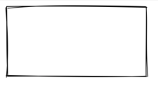
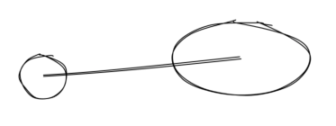
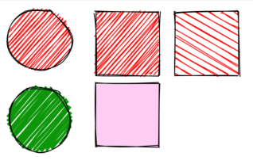
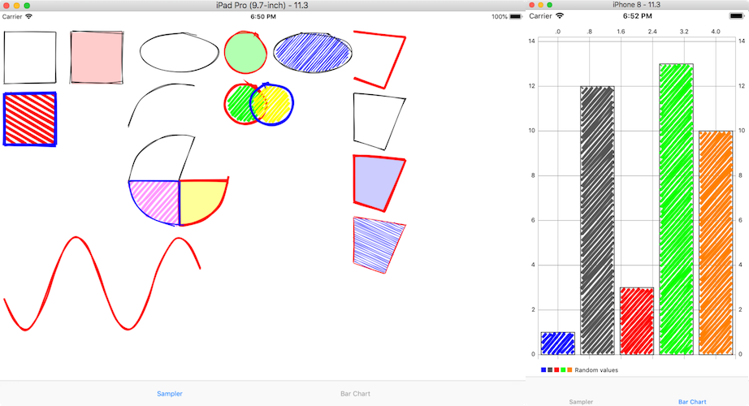

# Rough (Swift)

[](http://cocoapods.org/pods/Rough)
[](http://cocoapods.org/pods/Rough)
[](http://cocoapods.org/pods/Rough)

Rough lets you draw in a sketchy, hand-drawn-like, style. It is Swift clone of [Rough.js](http://roughjs.com/). The library defines primitives to draw lines, curves, arcs, polygons, circles, and ellipses.


## Requirements
Xcode 9, iOS 9

## Installation

Rough is available through [CocoaPods](http://cocoapods.org). To install
it, simply add the following line to your Podfile:

```ruby
pod 'Rough'
```

## Usage

```swift
let canvas = roughView.canvas
canvas.rectangle(origin: CGPoint(x: 10, y: 10), width: 200, height: 100)
roughView.setNeedsDisplay()
```

### Lines and Ellipses

```swift
canvas.circle(center: CGPoint(x: 80, y: 120), radius: 25)
canvas.ellipse(center: CGPoint(x: 300, y: 100), width: 150, height: 80)
canvas.line(from: CGPoint(x: 80, y: 120), to: CGPoint(x: 300, y: 100))
```

### Filling

```swift
canvas.circle(center: CGPoint(x: 50, y: 50), radius: 40) { options in
    options.fill = UIColor.red
} // fill with red hachure

canvas.rectangle(origin: CGPoint(x: 120, y: 15), width: 80, height: 80) { options in
    options.fill = UIColor.red
}

canvas.circle(center: CGPoint(x: 50, y: 150), radius: 40) {
    options in
    options.fill = UIColor(red: 10/255.0, green: 150/255.0, blue: 10/255.0, alpha: 1.0)
    options.fillWeight = 3 // thicker lines for hachure
}

canvas.rectangle(origin: CGPoint(x: 220, y: 15), width: 80, height: 80) { options in
    options.fill = UIColor.red
    options.hachureAngle = 60 // angle of hachure
    options.hachureGap = 8
}

canvas.rectangle(origin: CGPoint(x: 120, y: 105), width: 80, height: 80) { options in
    options.fill = UIColor(red: 1.0, green: 0, blue: 200/255.0, alpha: 0.2)
    options.fillStyle = .solid // solid fill
}
```


### Sketching style

```swift
canvas.rectangle(origin: CGPoint(x: 15, y: 15), width: 80, height: 80) { options in
    options.roughness = 0.5
    options.fill = UIColor.red
}

canvas.rectangle(origin: CGPoint(x: 120, y: 15), width: 80, height: 80) { options in
    options.roughness = 2.8
    options.fill = UIColor.blue
}

canvas.rectangle(origin: CGPoint(x: 220, y: 15), width: 80, height: 80) { options in
    options.bowing = 6
    options.stroke = UIColor.green
    options.strokeWidth = 3
}
```

### SVG Path
*TODO*

## Example

To run the example project, clone the repo, and run `pod install` from the Example directory first.




## Credits

Credits to [Rough.js](http://roughjs.com/) by [Preet](https://github.com/pshihn)


## License

Rough is available under the MIT license. See the LICENSE file for more info.
